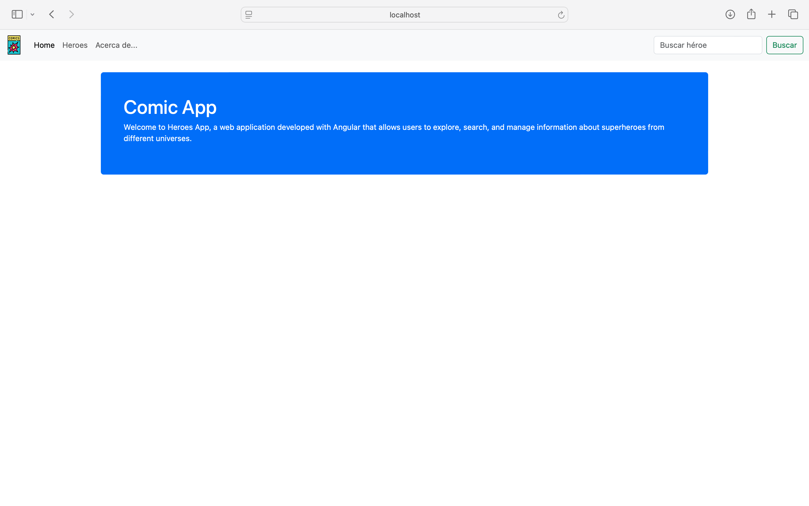
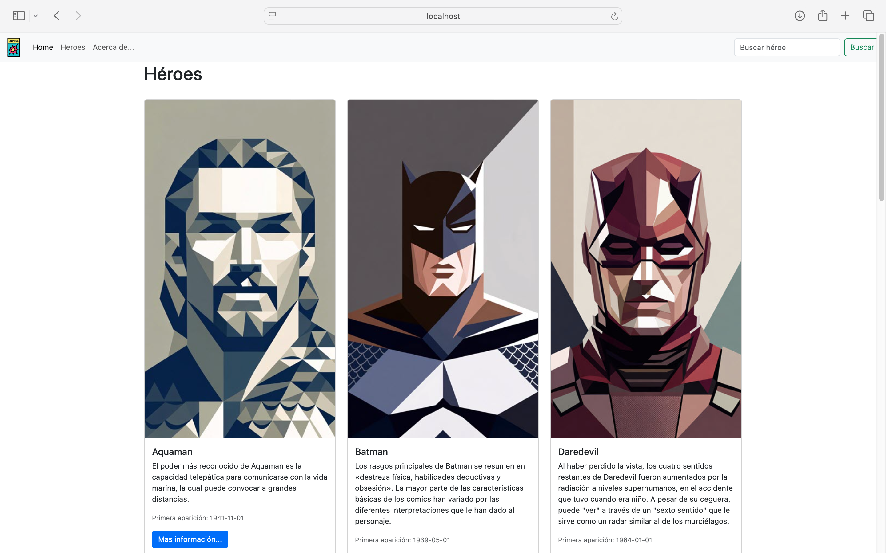
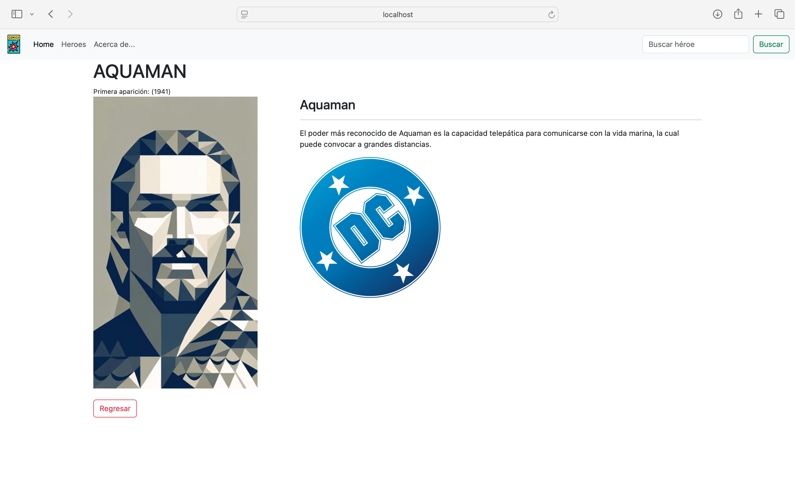

# 🦸 Angular Comic App

Aplicación web desarrollada con Angular que permite explorar, buscar y visualizar información de personajes de cómics a través de una interfaz moderna, intuitiva y responsiva.

Este proyecto fue desarrollado con el objetivo de fortalecer conocimientos en Angular, TypeScript, arquitectura basada en componentes, enrutamiento y desarrollo frontend.

## 🚀 Funcionalidades

* Visualización de personajes de cómics.
* Búsqueda de héroes por nombre.
* Visualización de información detallada de cada personaje.
* Navegación entre páginas mediante Angular Router.
* Componentes reutilizables.
* Diseño responsivo.
* Gestión de datos mediante servicios.

## 🛠️ Tecnologías Utilizadas

* Angular 21
* TypeScript
* HTML5
* CSS3
* Bootstrap
* RxJS
* Angular Router
* Git
* GitHub

## 📸 Capturas de Pantalla

### Página Principal



### Listado de Personajes




### Detalle del Personaje



## 📂 Estructura del Proyecto

```text
SPA/
├── public/
├── screenshots/
├── src/
│   ├── app/
│   ├── index.html
│   ├── main.ts
│   └── styles.css
├── .vscode/
├── angular.json
├── package.json
├── package-lock.json
├── tsconfig.app.json
├── tsconfig.json
├── tsconfig.spec.json
└── README.md
```

## ⚙️ Instalación

### 1. Clonar el repositorio

```bash
git clone https://github.com/marianadehesa/angular-comic-app.git
```

### 2. Entrar al directorio del proyecto

```bash
cd SPA
```

### 3. Instalar dependencias

```bash
npm install
```

### 4. Ejecutar la aplicación

```bash
ng serve
```

### 5. Abrir en el navegador

```text
http://localhost:4200
```

## 🎯 Objetivos de Aprendizaje

Este proyecto permitió reforzar conocimientos en:

* Desarrollo Front-End con Angular.
* Arquitectura basada en componentes.
* TypeScript.
* Routing y navegación.
* Consumo y gestión de datos mediante servicios.
* Organización modular de aplicaciones.
* Control de versiones con Git y GitHub.

